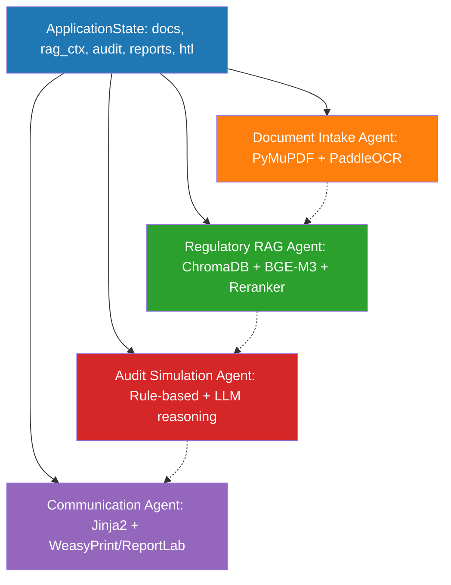

# Halal Koperasi Agent — Multi-Agent System for Halal Certification Readiness

[](https://www.python.org/downloads/)
[](https://opensource.org/licenses/MIT)
[](https://www.docker.com/)
[](https://langchain-ai.github.io/langgraph/)
[](https://www.trychroma.com/)
[](http://makeapullrequest.com)

> **Production-ready multi-agent system** that automates end-to-end Halal certification readiness assessment for Indonesian MSME cooperatives. Built with **LangGraph**, **ChromaDB**, and **local LLMs (Ollama)**.

---

## 🎯 The Problem

> **60%+ of Indonesia's small farmer/fishery cooperatives lack Halal certification** (Kemenkop 2024), despite **mandatory Halal enforcement by October 2026** (UU 33/2014).

**Key barriers for MSMEs:**
- **15+ required documents** (AKTA, NPWP, NIB, SOP, Bahan Baku, Rute Produksi, HAS structure, dll.)
- **Fragmented regulations** across UU, PP, BPJPH Peraturan, Fatwa MUI, LPH guidelines, SNI
- **No internal HAS expertise** — most cooperatives lack trained Halal Assurance System staff
- **Manual process takes 3–6 months** with high LPH audit rejection rates due to document gaps/inconsistencies
- **Cost-prohibitive** for micro cooperatives to hire consultants

---

## 💡 Solution: 5-Agent Collaborative System

| Agent | Role | Core Capability |
|-------|------|-----------------|
| **Orchestrator** (LangGraph) | Coordinator | State management, human-in-the-loop, conditional routing, checkpointing |
| **Document Intake** | Parser & Validator | OCR + extraction + completeness scoring per PP 39/2021 |
| **Regulatory RAG** | Knowledge Retrieval | Grounded QA on UU 33/2014, PP 39/2021, BPJPH, MUI, LPH, SNI |
| **Audit Simulation** | Gap Analyzer | Simulates LPH audit (~80 checklist items) → readiness score + prioritized gaps |
| **Communication** | Report Generator | PDF/HTML reports, email drafts, Excel checklists, explainability traces |



---

## 🛠️ Tech Stack

| Layer | Technology | Rationale |
|-------|------------|-----------|
| **Orchestration** | **LangGraph** (StateGraph) | Native multi-agent, checkpointing, HITL, conditional edges |
| **LLM (Local)** | **Ollama**: `llama3.1:8b-instruct-q4_K_M` | Free, private, Indonesian-capable, function calling |
| **Embedding** | **BGE-M3** via Ollama | Multilingual, strong Indonesian, 1024-dim |
| **Reranker** | **BGE-Reranker-v2-M3** via Ollama | Cross-encoder quality, local inference |
| **Vector DB** | **ChromaDB** (persistent, HNSW) | Lightweight, Python-native, metadata filtering |
| **RAG Framework** | **LangChain + LangGraph** | Modular, composable, evaluator integration |
| **Doc Parsing** | **PyMuPDF** (text) + **PaddleOCR** (scans) | Fast PDF text + multilingual OCR |
| **Evaluation** | **RAGAS** + Custom Evaluator Agent | Industry standard + domain-specific |
| **UI Prototype** | **Streamlit** | Rapid, interactive, sufficient for stakeholder demo |
| **Deployment** | **Docker Compose** | Reproducible, single-command startup |

---

## 📁 Project Structure

```
halal-koperasi-agent/
├── .github/workflows/          # CI: lint, test, eval
├── data/
│   ├── koperasi_profiles/      # YAML profiles (20 synthetic cooperatives)
│   ├── regulatory_chunks/      # Chunked regulations (JSONL per source)
│   ├── templates/              # Jinja2 templates for synthetic doc generation
│   ├── synthetic_docs/         # Generated PDFs + metadata per cooperative
│   └── eval/                   # Ground truth, test questions, e2e cases
├── docs/
│   ├── ARCHITECTURE.md         # Detailed architecture & data flow
│   ├── DATA_SCHEMA.md          # Pydantic schemas + synthetic data design
│   ├── EVALUATION.md           # Metrics & methodology
│   ├── DEPLOYMENT.md           # Docker, Ollama, production notes
│   └── CASE_STUDY.md           # End-to-end case study
├── src/
│   └── halal_koperasi_agent/
│       ├── __init__.py
│       ├── config.py           # Pydantic Settings
│       ├── state.py            # ApplicationState (TypedDict + Pydantic)
│       ├── graph.py            # LangGraph StateGraph definition
│       ├── agents/
│       │   ├── __init__.py
│       │   ├── base.py         # BaseAgent class
│       │   ├── document_intake.py
│       │   ├── regulatory_rag.py
│       │   ├── audit_simulation.py
│       │   ├── communication.py
│       │   └── evaluator.py
│       ├── tools/
│       │   ├── __init__.py
│       │   ├── pdf_parser.py
│       │   ├── ocr.py
│       │   ├── validators.py
│       │   ├── vector_store.py
│       │   └── report_generator.py
│       ├── schemas/
│       │   ├── __init__.py
│       │   ├── documents.py
│       │   ├── regulatory.py
│       │   ├── audit.py
│       │   └── communication.py
│       ├── evaluation/
│       │   ├── __init__.py
│       │   ├── metrics.py
│       │   ├── dataset.py
│       │   └── runner.py
│       └── utils/
│           ├── __init__.py
│           ├── logging.py
│           └── helpers.py
├── tests/
│   ├── unit/
│   ├── integration/
│   └── e2e/
├── scripts/
│   ├── ingest_regulations.py
│   ├── generate_profiles.py
│   ├── generate_synthetic_docs.py
│   ├── generate_ground_truth.py
│   └── run_eval.py
├── app/
│   └── streamlit_app.py
├── docker-compose.yml
├── Dockerfile
├── pyproject.toml
├── requirements.txt
├── requirements-dev.txt
├── .env.example
└── LICENSE
```

---

## 🚀 Quick Start

### Prerequisites
- Docker & Docker Compose
- NVIDIA GPU (recommended, 8GB+ VRAM) for Ollama acceleration
- Or CPU-only (slower): 16GB+ RAM

### 1. Clone & Configure
```bash
git clone https://github.com/your-org/halal-koperasi-agent.git
cd halal-koperasi-agent
cp .env.example .env
# Edit .env if needed (model names, ports, etc.)
```

### 2. Start Services
```bash
docker compose up -d
# Services:
#   - ollama:     http://localhost:11434
#   - chromadb:   http://localhost:8000
#   - app:        http://localhost:8501 (Streamlit UI)
```

### 3. Pull Models (first run, ~8GB)
```bash
docker compose exec ollama ollama pull llama3.1:8b-instruct-q4_K_M
docker compose exec ollama ollama pull bge-m3
docker compose exec ollama ollama pull bge-reranker-v2-m3
```

### 4. Ingest Regulatory Knowledge Base
```bash
docker compose exec app python scripts/ingest_regulations.py --source all
# Creates ~700 chunks across 7 ChromaDB collections
```

### 5. Generate Synthetic Test Data
```bash
docker compose exec app python scripts/generate_synthetic_docs.py --profiles data/koperasi_profiles/
# Generates 20 cooperatives × 15 documents = 300 PDFs + metadata
```

### 6. Run End-to-End Demo
```bash
# CLI (headless)
docker compose exec app python -m halal_koperasi_agent.cli run --koperasi kmbj

# Streamlit UI
# Open http://localhost:8501
```

### 7. Run Full Evaluation
```bash
docker compose exec app python scripts/run_eval.py --test-set all
# Outputs: evaluation/results/ + evaluation/figures/
```

---

## 📊 Evaluation Results (Target Metrics)

| Dimension | Metric | Target | Method |
|-----------|--------|--------|--------|
| **Accuracy** | Document validation F1 | ≥ 0.85 | vs 20 expert-labeled docs |
| **Effectiveness** | Audit readiness Spearman ρ | ≥ 0.75 | vs LPH auditor panel |
| **Efficiency** | End-to-end latency p95 | < 30s | 100 runs |
| **Explainability** | Citation coverage | 100% | Auto-verify citation field |
| **Hallucination** | LLM-judge rate | < 5% | 200 QA pairs, GPT-4o evaluator |

*See [EVALUATION.md](docs/EVALUATION.md) for methodology and [evaluation/results/](evaluation/results/) for latest runs.*

---

## 🗺️ Roadmap

| Phase | Focus | Status |
|-------|-------|--------|
| **v1.0** | Core 5-agent system, synthetic data, evaluation suite | ✅ Done |
| **v1.1** | Real regulatory PDF ingestion (JDIH BPJPH), improved OCR | 🚧 In progress |
| **v1.2** | Streamlit dashboard: review/approve HITL checkpoints | 📋 Planned |
| **v2.0** | Fine-tuned LoRA (Llama-3.1-8B) on Halal QA, SEHATI API integration | 🔮 Future |

---

## 🤝 Contributing

We welcome contributions! Please see [CONTRIBUTING.md](CONTRIBUTING.md) for guidelines.

**Quick start for contributors:**
```bash
# Install dev dependencies
pip install -r requirements-dev.txt
pre-commit install

# Run tests
pytest tests/ -v

# Lint
ruff check src/ tests/
black src/ tests/
```

---

## 📚 Domain References

| Regulation | Source |
|------------|--------|
| UU No. 33/2014 — Jaminan Produk Halal | [BPJPH](https://bpjph.halal.go.id/regulasi/uu) |
| PP No. 39/2021 — Pelaksanaan JPH | [BPJPH](https://bpjph.halal.go.id/regulasi/pp) |
| BPJPH Peraturan 1/2023 — Prosedur Pengajuan | [BPJPH](https://bpjph.halal.go.id/regulasi/peraturan-bpjph) |
| BPJPH Peraturan 2/2023 — Verifikasi & Audit | [BPJPH](https://bpjph.halal.go.id/regulasi/peraturan-bpjph) |
| Fatwa MUI Halal | [MUI](https://mui.or.id/fatwa/) |
| SNI 99001:2023 — HAS | [BSN](https://www.bsn.go.id/) |
| Kominfo 9/2023 — Aksesibilitas Digital | [JDIH Kominfo](https://jdih.kominfo.go.id/) |

---

## 📄 License

MIT License — see [LICENSE](LICENSE)

---

## 🙏 Acknowledgments

- **BPJPH, MUI, LPH** for official regulations & guidelines
- **Open source**: LangChain, LangGraph, ChromaDB, Ollama, BGE, RAGAS, PaddleOCR, PyMuPDF, Streamlit
- **Indonesian MSME ecosystem** — this project aims to serve you

---

> **Built for real-world impact.** If you're an LPH, consultant, or cooperative association interested in piloting or collaborating, please [open an issue](https://github.com/your-org/halal-koperasi-agent/issues) or reach out.